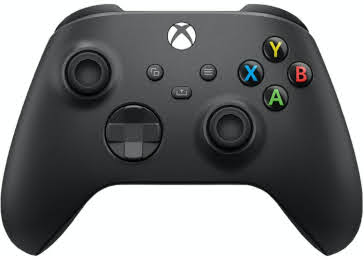

# gamepad-ble

Use a Bluetooth Low-Energy (BLE) gamepad to control your Particle project.

## Compatible boards

Particle boards with built-in BLE are compatible.

* Photon 2 / P2

Note: The Argon and Boron have built-in BLE but there's an issue pairing with the Xbox controller so it's not listed in the compatible list yet.

## Compatible gamepads

* [Xbox Wireless Controller](https://www.amazon.com/dp/B088GJR4B9). The model 1914 with 3 buttons has BLE.<br>
  
* Other BLE controllers listed on [this list](https://bluepad32.readthedocs.io/en/latest/supported_gamepads/#bluetooth-gamepads-and-their-protocol) may also be compatible.

Note that most Bluetooth gamepads use Bluetooth Classic, not BLE so they are not compatible. Non-exhaustive list of incompatible gamepads: Playstation 3/4, Nintendo Switch/Wii, 8BitDo.

## Usage

Add the gamepad-ble library to your project and put your gamepad in pairing mode.

```
#include "gamepad-ble.h"

SerialLogHandler logHandler(LOG_LEVEL_INFO);

Gamepad gamepad;

void setup() {
  gamepad.begin();
}

void loop() {
  gamepad.process();

  if (gamepad.valid()) {
    Log.info("%s x1=%5d y1=%5d %s %s %s %s", gamepad.name, gamepad.x1, gamepad.y1,
      gamepad.a ? "a" : " ", gamepad.b ? "b" : " ",
      gamepad.x ? "x" : " ", gamepad.y ? "y" : " ");
  }
}
```

## Documentation

### `Gamepad.begin()`

Turns on BLE.

### `Gamepad.process()`

Blocks for up to 5 seconds to scan and connect to BLE gamepads.

When it finds a BLE gamepad, it connect and pair to the first one.

### `Gamepad.valid()`

True when connected and paired to a gamepad and some valid data has been received. Will become false again if the gamepad disconnects.

### `Gamepad.name`

When `Gamepad.valid()` is true, `Gamepad.name` is the name of the gamepad you're connected to.

### Buttons for Xbox Wireless Controller

List of axes and buttons available on `Gamepad`:
* `x1`: left thumbstick X from 0 to 65535.
* `y1`: left thumbstick Y from 0 to 65535.
* `x1`: right thumbstick X from 0 to 65535.
* `y1`: right thumbstick Y from 0 to 65535.
* `leftTrigger`: left trigger from 0 to 1023.
* `rightTrigger`: right trigger from 0 to 1023.
* `dpad`: 8-direction D-pad from 0 to 8.
* Buttons (boolean):
  - `a`
  - `b`
  - `x`
  - `y`
  - `leftBumper`
  - `rightBumper`
  - `leftStick`
  - `rightStick`
  - `xbox`
  - `view`
  - `share`
  - `menu`

### Buttons for generic controller

If the gamepad type is not detected, get the raw data from `Gamepad.data` vector.

## LICENSE
Copyright 2024 Julien Vanier <jvanier@gmail.com>

Licensed under the MIT license
